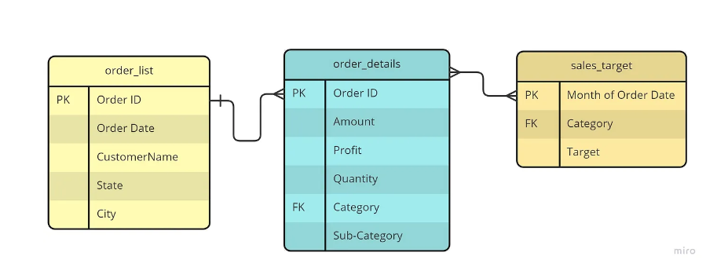

<b>Background</b>

Sales analysis is commonly used in companies to identiy trends in sales. his data is perfectly curated to perform sales analysis. We have an e-commerce sales dataset from India with 3 csv files -List of Orders, Order details, Sales target.

What's inside?
List of Orders-This dataset contains purchase information. The information includes ID, Date of Purchase and customer details
Order Details- This dataset contains order ID, with the order price, quantity,profit, category and subcategory of product
Sales target-This dataset contains sales target amount and date for each product category

Dataset taken from: https://www.kaggle.com/datasets/benroshan/ecommerce-data?resource=download&select=Sales+target.csv

<b> ER Diagram </b>

We will be performing the analysis of the data in both SQL and Python.

Data has been imported using flat file as source in SQL management studio. 

Here are some of the questions we will be answering: 

1. What is the average sales made for each month based on category?
2. Which months have the target not been made/made based on category?  
3. What is the profit/loss margin made for each category? 
4. Which months do we see the highest sales?
5. For each category- return the subcategory performing the best in terms of sales and the subcategory with lowest number of sales/profit.
6. Return the top 5 or top 10 customers who made the most purchases.
7. Which states have the highest sales and their profit margins?
8. What has the sale,profit been over the few months and its growth percentage over time? 

Modelling:
Write a model to predict the sales for the next few months.
